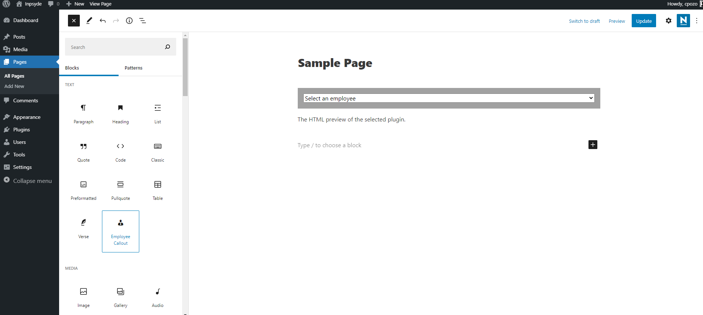
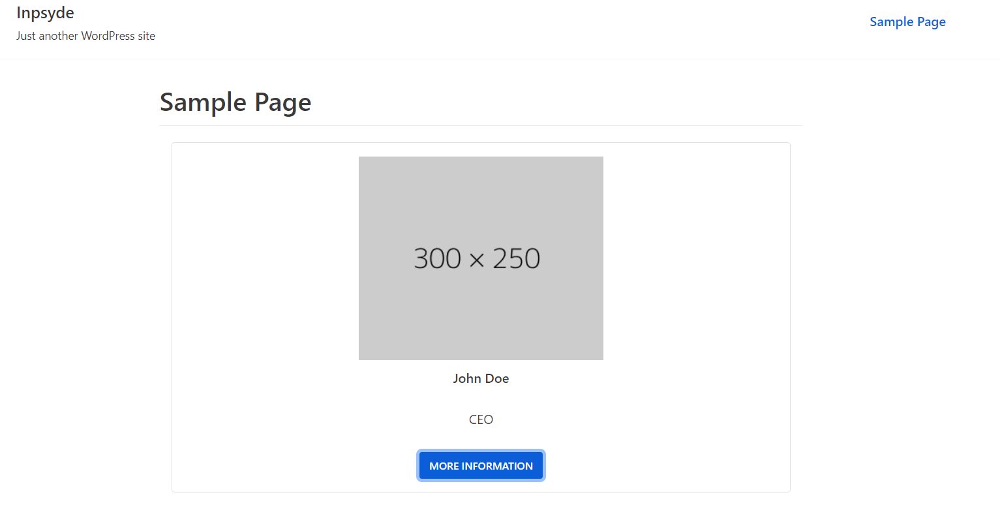
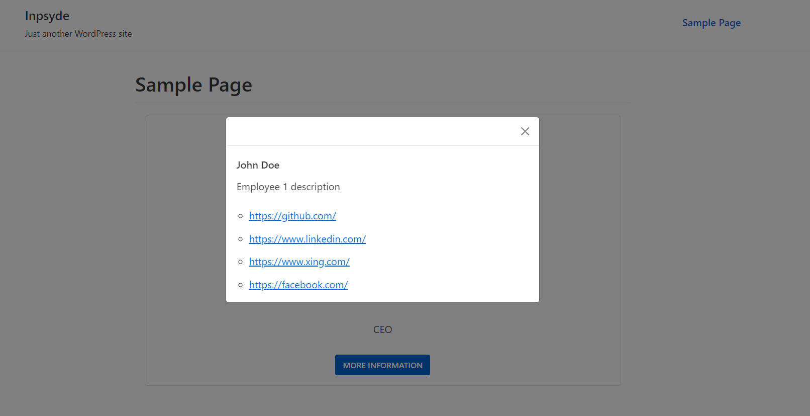

# Wordpress plugin for overview of the company staff

The plugin allows the user to add a new block to select a specific employee from a list generated by an external demo API with the required information. The result allows to visualize the detail of the employee using Bootstrap 5 through a modal.

## Instructions
```
npm install
```

## Composer Dependencies
    - inpsyde/php-coding-standards: Style guide for writing consistent php
    - PHPUnit: For unit tests

## Node Dependencies
    - Bootstrap: For responsive modal and layout. 
    - @wordpress/scripts: Wordpress build tool for minify, transpile and use JSX sintaxis

## Justification

I started by creating a development environment with the help of a composer-based core. For the creation of the plugin, I generated a JSON with dummy data to simulate the employees of the company. Within the editor logic I created a block selector to display all the names of the employees, so that the user can select which one to display. Finally, for creating the modal I have used bootstrap 5 because it is a robust framework and allows to quickly create responsive elements.

## Demo


